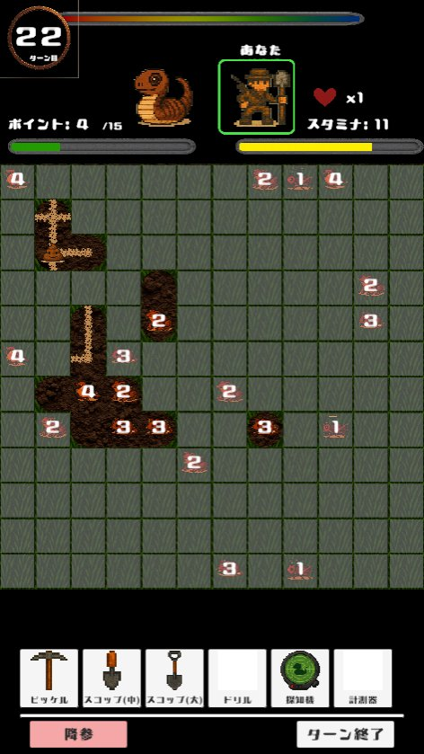
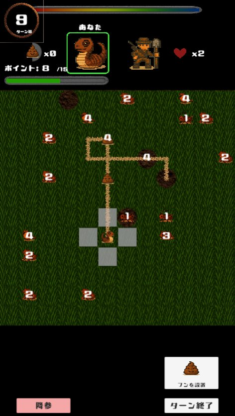
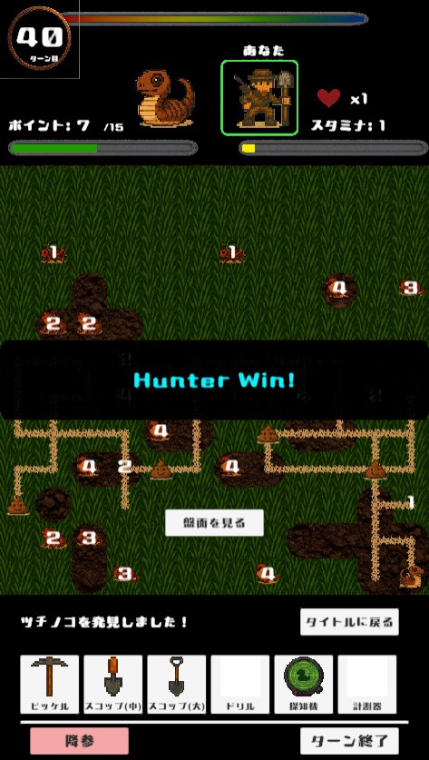
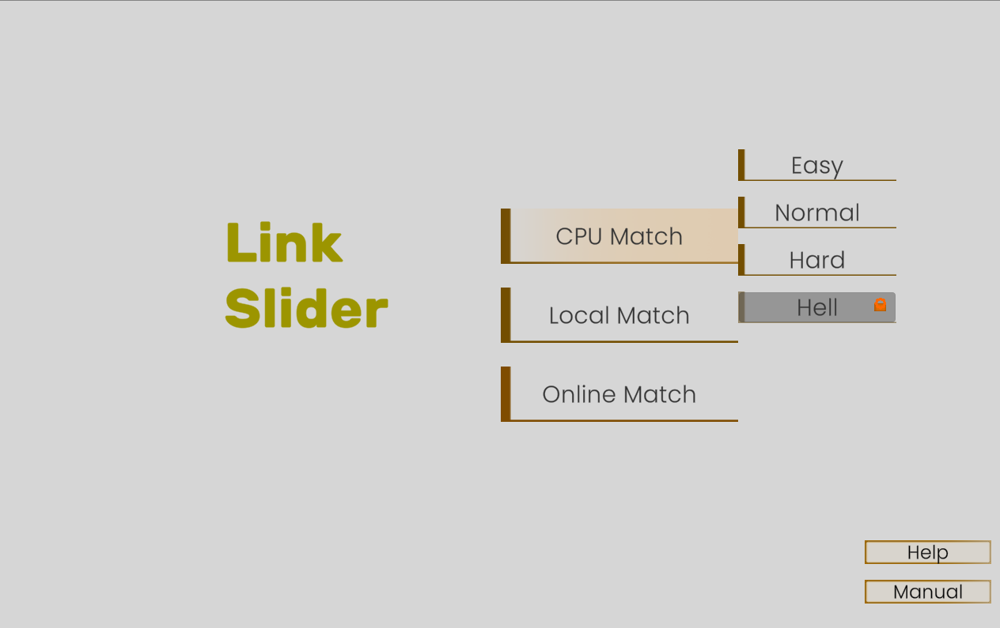
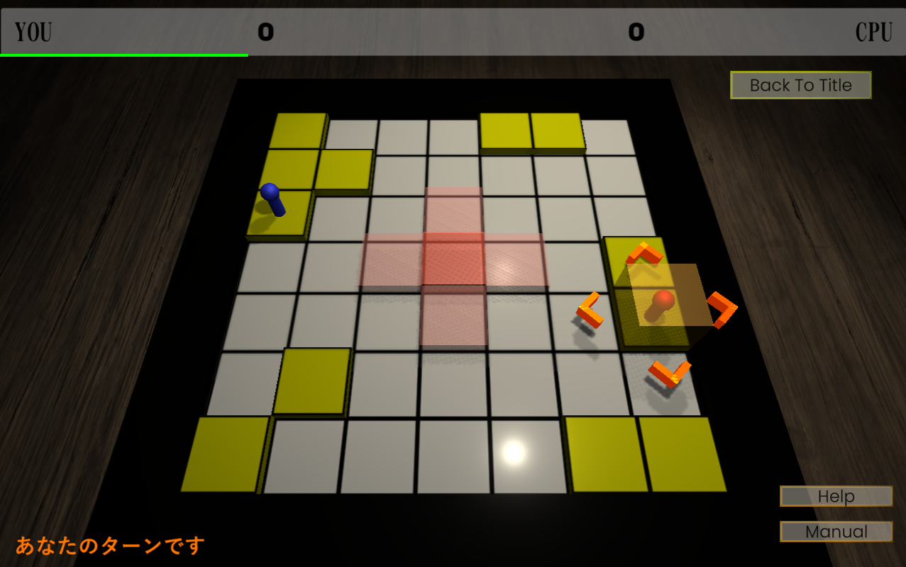
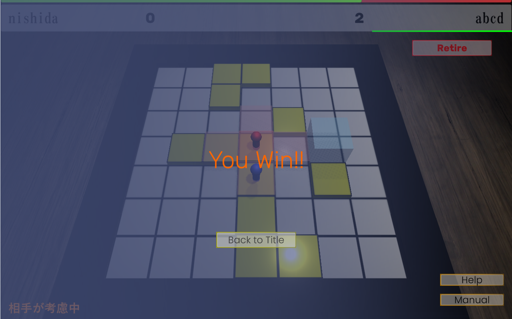
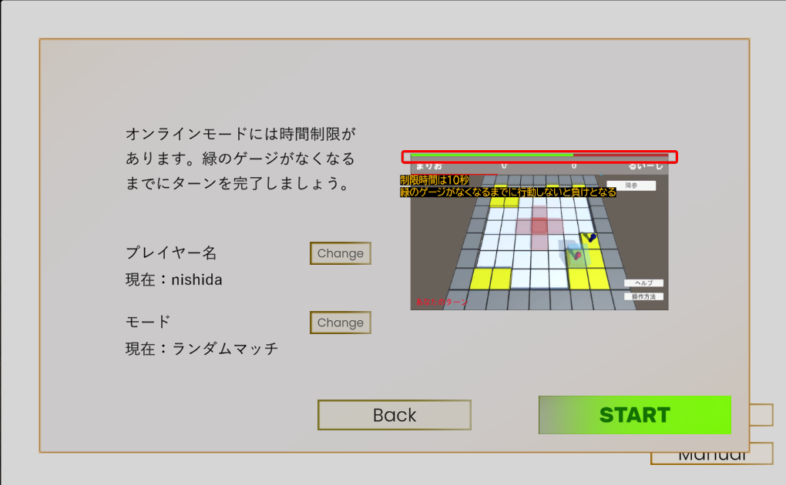
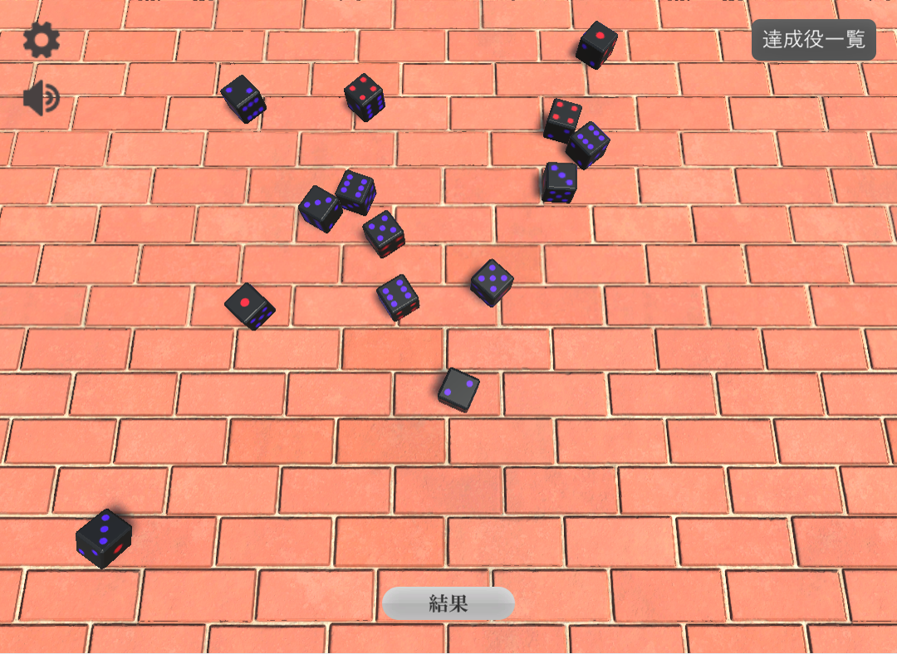
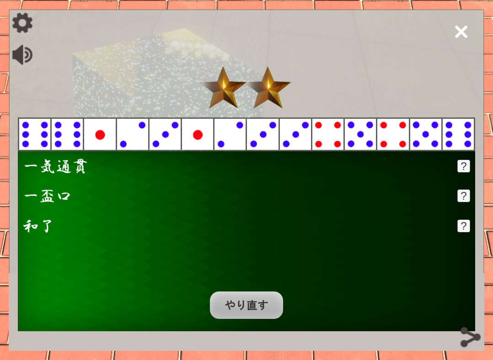
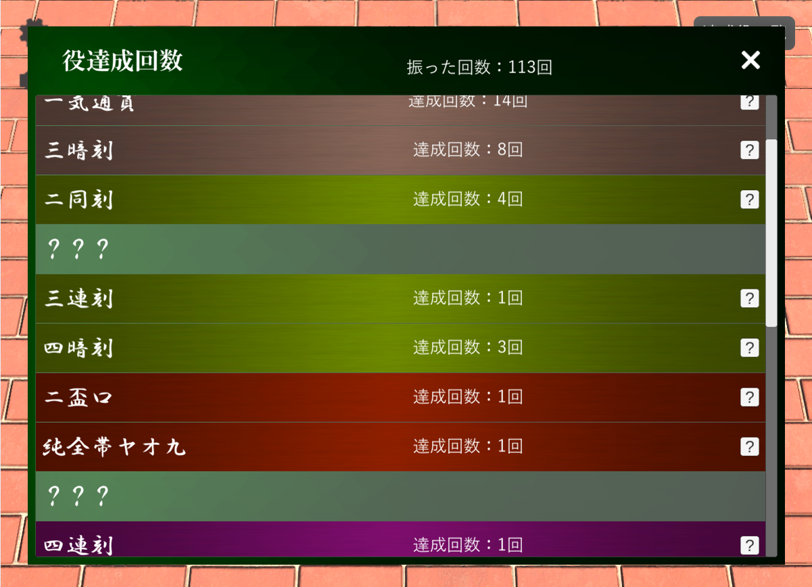

# Portfolio

## 自己紹介
**西田星翔** 
にしだほしと 
 
京都大学情報学研究科に所属するエンジニア志望の大学院生です。 

## HEAL
５人チームでのWebアプリのプロトタイプ開発 
〇概要 
_Healthcare Empowerment through AI Linguistic_ 
留学生などが自国以外で診療を受ける際、医師の質問や治療の説明をよく理解できない不安を解消するための診療補助システム 
〇機能 
・AIが具合の悪いところやいつから症状があるかなどの問診を母国語で行う 
・医者と患者の診察チャットではそれぞれの母国語に翻訳 
・診察時には医者側のチャットに含まれる医療用語をAIが判別し、タップすることで医療用語データベースから解説を提示、データベースになければ解説をAIが自動で生成 
〇工夫点 
・covid-19やcorona,covidなど同義で複数の言い方があるものを統一するために同義語テーブルを作成 
・医療用語データベースの内容は医者が書き換え可能で、医者の承認があるかどうか判別可能に 

  
  
  

〇担当 
主にバックエンド 
DB処理・API実装・LLM接続 
〇使用ツール 
Python,Flask,SQLite,OpenAIAPI

## ちょろよい
５人チームでのモバイルアプリのプロトタイプ開発 
〇概要 
お酒があまり得意ではない人向けの飲み会支援アプリ 
スムーズな注文ができるように心がけて制作 
〇機能 
・メニュー表の写真からOCR技術を使用して商品名を抽出 
・アンケートから気分を入力しお酒を提案 
・杯数表示と飲みすぎ防止のための警告を行い、今までに飲んだお酒も記録される 
〇工夫点 
・お品書きにあるお酒のテキストをタップすると、そのお酒を注文するかどうか選択でき、長押しするとお酒の詳細が表示される。お酒にあまり詳しくなくてもすぐにどんなお酒か分かるように 

  
  
  
  

〇担当 
主にフロントエンド 
画面遷移・表示処理・ログイン機能・全体デバッグ 
〇使用ツール 
TypeScript,HTML/CSS,ReactNative,firebase

## ゲーム
趣味で行っているチームまたは個人のゲーム開発 
〇使用ツール 
C#,Unity 

### ツチノコ見つけた（オンラインボードゲーム/開発中）
３人チームでのモバイルゲーム開発 
〇概要 
ツチノコとハンターに分かれて行うターン制のボードゲーム 
12×12マスの中でツチノコのいるマスをハンターが探索すればハンターの勝ち 
ツチノコはハンターに見つからずにアイテムを集めきれば勝ちとなる 
〇機能 
・オンライン対戦 
・CPU対戦 
〇工夫点 
・試行を繰り返しながらゲーム性を強化 
・ハンター側のCPUは強化学習を用いてAgentを作成 
〇担当 
インゲームシステム 

  
  
  

### リンクスライダー（対戦型パズルゲーム）
Webで遊べるゲームを個人開発 
〇概要 
昔好きだったアニメに登場する二人対戦型のパズルゲームの再現 
２人のプレイヤーがスライダーを乗り継ぎしながら中央のマスに先に停止した方の勝ちとなる 
〇機能 
・CPUとの対戦(EASY/NORMAL/HARD/HELLの四つの難易度) 
・ローカル対戦 
・オンライン対戦(ランダムマッチ/プライベートマッチ)(時間制限あり) 
〇工夫点 
・もともとのゲームでは消極的な行動が最善となってしまう場合があるため、得点マスの機能を追加してゲームのバランスを調整。戦術の幅が広がってより面白くなった 
・CPUはMiniMax法のアルゴリズムを採用、より人間らしい動きをするように評価値を改善 
・画面遷移時やマッチング中のアニメーションを含め統一感のあるデザインに 

  
  
  
  

[ここ](https://unityroom.com/games/link_slider)をクリックして遊ぶ 

### サイコロ麻雀（ミニゲーム）
Webで遊べるゲームを個人開発 
〇概要 
１４個のサイコロを振って役を作る１人用の暇つぶしゲーム 
ボタンをクリックするだけで遊べる 
〇機能 
・サイコロの出た目を取得し役判定を行う 
・今までに出た役は保持され一覧として表示 
〇工夫点 
100万回のシミュレーションを行ってレア度を設定 

  
  
  

少数ですが何人かTwitterで共有してくれました 

  
  
  

[ここ](https://unityroom.com/games/dice_mahjong)をクリックして遊ぶ 

### そのほかのゲーム

## 研究
〇概要 
アバターロボットと呼ばれる遠隔操作分身ロボットを用いた接客は場所を問わない点や衛生面で魅力的 
これを用いてカスタマーハラスメント対策システムを開発 
〇手法 
ワーカーインタビューを通じて丁寧な口調がストレスを感じにくいという知見を得る 
顧客の音声を排除し、丁寧な印象のテキストに変換して表示させるシステムを考案 
音声合成の機能を追加し実験を行う 
〇工夫点 
・顧客側がラグを感じさせないようにフィラーを入れたりロボットに動きを追加したり 
・音声認識への不安を軽減するため、リプレイボタンを追加して音声を聞ける機能を追加 
・クレームの文を200以上集めてテキスト変換を行いながらプロンプトを改良 

  
  

〇使用ツール 
Python,ROS,Whisper(OpenAI),GPT4o

## インターン
### LLMを用いたWebアプリ
４人チームでのアプリ開発 
〇担当 
バックエンド 
DB設計・機能設計・LLM処理 
〇使用ツール 
Python,FastAPI,mySQL,OpenAIAPI,BingSearchAPI,langchain

### 経路探索APIを利用したWebアプリ
２人チームでのフロントエンドアプリ開発 
〇使用ツール 
JavaScript,Vue

