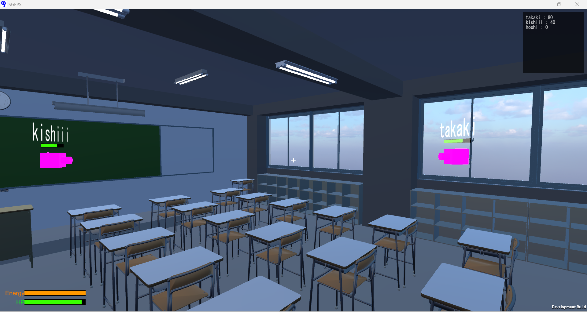

# Portfolio

## HEAL
５人チームでのプロトタイプアプリ開発 
・概要 
_Healthcare Empowerment through AI Linguistic_ 
留学生などが自国以外で診療を受ける際、医師の質問や治療の説明をよく理解できない不安を解消するための診療補助システム 
・機能 
問診、診察チャットをそれぞれの母国語に変換 
医療用語をAIが判別し、医療用語データベースから解説を提示 

  
  
  

・担当 
主にバックエンド 
DB処理・API実装・LLM接続 
・使用ツール 
Python,Flask,PeeWee,OpenAIAPI

## ちょろよい
５人チームでのプロトタイプアプリ開発 
・概要 
お酒があまり得意ではない人向けの飲み会支援アプリ 
・機能 
メニュー表の写真から商品名を抽出 
アンケートから気分を入力しお酒を提案 
飲みすぎ防止のための杯数表示と飲んだお酒の記録 

  
  
  
  

・担当 
主にフロントエンド 
画面遷移・テキスト処理・ログイン機能・DB処理 
・使用ツール 
TypeScript,ReactNative,firebase

## ゲーム
個人開発 
・使用ツール 
C#,Unity,Blender
### オンラインFPS
・概要 
複数人のオンラインで遊べるFPSゲーム 
弾を当てれば点数が増え、当たられたらＨＰが減るだけの単純な内容
（ＨＰが０になれば派手に爆散します） 
ワールドは作成者の高校の教室を再現 

  
  
  

### 対戦型パズルゲーム
・概要 
二人対戦型のパズルゲームの再現 
オンライン対戦とローカル対戦が可能 
[ここ](https://unityroom.com/games/link_slider)をクリックして遊ぶ

  
  

### ミニゲーム
・概要 
１人用の暇つぶしゲーム 
ボタンをクリックするだけで遊べる 
[ここ](https://unityroom.com/games/dice_mahjong)をクリックして遊ぶ

  
  
  

## 研究
・概要 
アバターロボットと呼ばれる遠隔操作分身ロボットを用いた接客は場所を問わない点や衛生面で魅力的 
これを用いたカスタマーハラスメント対策システムを提案する 
・手法 
ワーカーインタビューを通じて丁寧な口調がストレスを感じにくい可能性 
顧客の音声を丁寧な印象のテキストに変換するシステムを考案 

  
  

・使用ツール 
Python,ROS,Whisper(OpenAI),GPT4o

## 夏季インターン
### LLMを用いたWebアプリ
４人チームでのアプリ開発 
・担当 
バックエンド 
DB設計・機能設計・LLM処理 
・使用ツール 
Python,FastAPI,mySQL,OpenAIAPI,BingSearchAPI,langchain
### 経路探索APIを利用したWebアプリ
２人チームでのフロントエンドアプリ開発 
・使用ツール 
JavaScript,Vue

